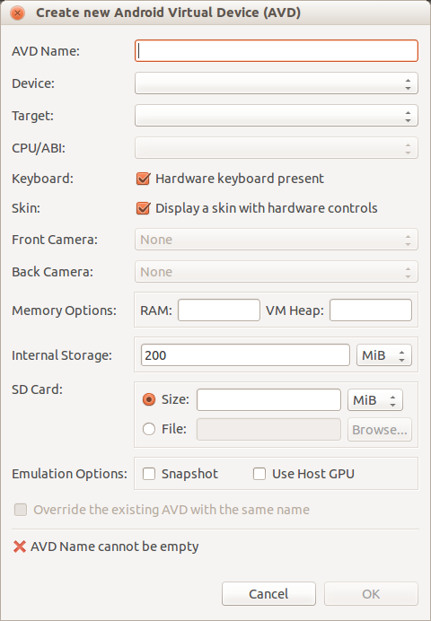

## Creating a Android Virtual Device 

Basically you should follow the normal procedure, as described on the
Android Developer pages manual: http://developer.android.com/tools/devices/index.html.

We do, however, provide a guide below to make this easier. You can
choose to use our settings or change some at your will. In this guide
we will setup a Nexus 7 device.

### Start Android Virtual Device Manager

In a terminal, type:

`android avd`

In the Android Virtual Device Manager window click "New"

### Create new Android Virtual Device (AVD)

* Name:	    eGov-android-machine
* Device:   Nexus 7
* Target:   Android 4.2

You can keep the default values for all other settings.

