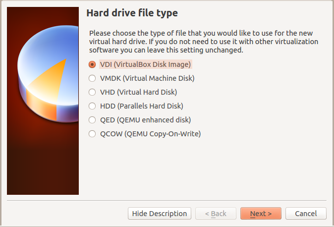
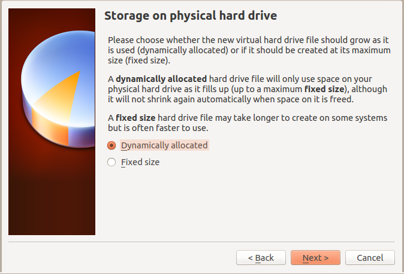
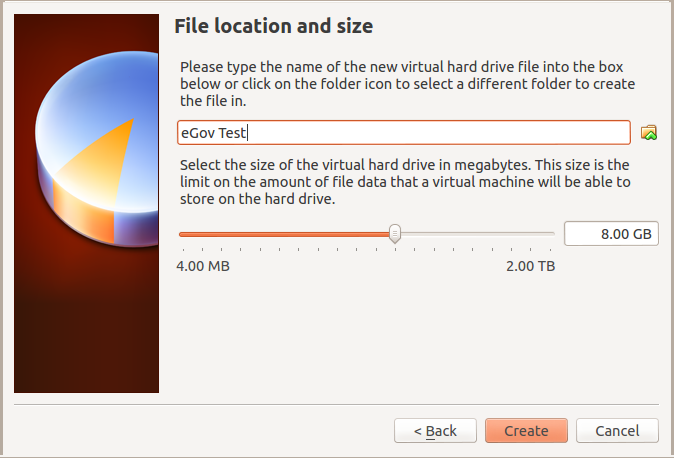
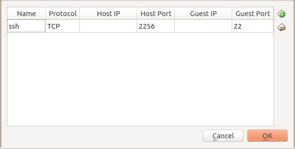
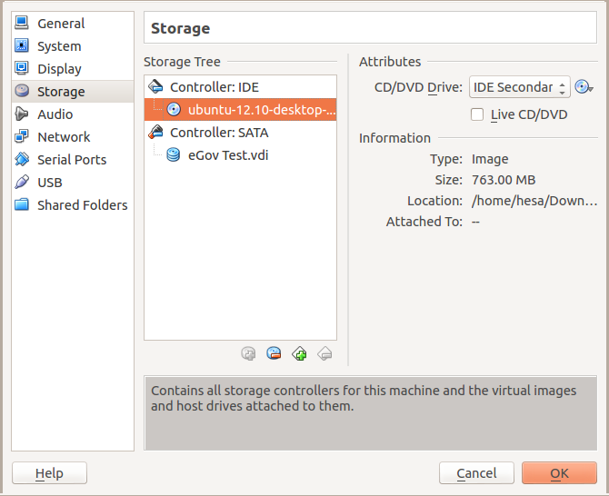

## Creating a VirtualBox machine with Ubuntu 12.10 

Basically you should follow the normal procedure, as described in the
VirtualBox manual, on how to create a new virtual machine. However we
provide a guide below to make this easier. You can choose to use our
settings or change some at your will.

**Note:** *If you’re on a Ubuntu system you might have to add your user to the vboxusers group. This can done like this: <code>sudo adduser \`whoami\` vboxusers</code>.*

### Start Virtualbox

In a terminal, type:
`virtualbox`

In the VM Virtualbox Manager window click "New"

### Name and operating system

* Name:	    eGov testing machine
* Type:	    Linux
* Version:  Ubuntu (64 bit)

### Memory size

* 2048 MB

### Hard drive

* Choose to create a virtual hard drive now

### Hard drive file type

* Choose VDI 

### Storage on physical hard drive

* Choose Dynamically allocated

### File location and size

* 8 GB should be enough

Your disk has now been created. Before starting it we need to do some additional settings.

### Network

#### Setup the network card

* Open up the VirtualBox Manager
* Choose your Virtual machine and click Settings
* Make sure Network Adapter 1 is enabled. 

The following settings should be applied to Adapter 1.

**Attached to**:  NAT (previously Bridged adaptor was advised)

* **Name**:       eth0
* **Advanced**:     
* **Adapter type**:		Intel PRO/1000 MT Desktop (...)
* **Promiscuous mode**: 	Deny
* **MAC Address**:		use the suggested
* **Cable connected**:		should be checked

*This gives your virtual machine an IP address on the same subnet as
 the host computer. See http://www.virtualbox.org/manual/ Chapter 6
 for additional information on bridged networking.*

##### Allowing SSH logins to your virtual machine

Open up the VirtualBox Manager

Choose your Virtual machine and click Settings

Choose Port forwarding

Add a new rule by clicking the + sign. Enter

* **Rule**: ssh
* **Protocol**: TCP
* **Host IP**:
* **Host Port**: 2256   (the value can basically be any free port on your host computer)
* **Guest IP**:
* **Guest Port**: 22

#### USB

Make sure USB is enabled if you plan to use a smart card reader or another USB device.

You might encounter an error saying "Failed to access the USB subsystem". In that case, you probably need to add yourself to the vboxusers group. On Ubuntu, this can done like this: <code>sudo adduser \`whoami\` vboxusers</code>.

To use a smart card reader in your virtual machine you have to do the following:

* Attach the smart card reader to your computer
* Add Filter from Device (Alt + Ins) and choose the device that is attached to the physical machine. 
* The same procedure applies to other peripherals, like a USB storage device.

See http://www.virtualbox.org/manual/ Chapter 3 for additional information

### Installing Ubuntu

Download the preferred Ubuntu iso image from ubuntu.com

Click Settings and choose storage. 

Add the downloaded iso image to the virtual machine as a CD-ROM by clicking the Empty icon (image missing) under Controller: IDE and then click on the disc icon right of the text CD/DVD Drive: . 

Choose a virtual CD/DVD disk file ... and point out the downloaded iso image (e.g. ubuntu-12.10-desktop-amd64.iso).

Click Start

Follow the installation instructions to install Ubuntu in your new virtual machine.

#### Upgrading your installation

To upgrade your system you need to:

* Click on the Software updater icon to your left (it may take up to a few minutes before the icon appears)
* Click install now
* Enter password

_Note:_ If the Software Updater icon is not available in the sidebar, you can press the "Win/Super" key and type "Software Updater" to start it.

Ubuntu might require a restart when the update process is finished.

#### Installing necessary tools in your virtual machine

The following tools need to be installed on your virtual machine

* openssh-server

Install them by typing the following command in a terminal window,
assuming you’re logged in as your first user (created during the
Ubuntu installation):

sudo apt-get install openssh-server

#### Setting up users on the virtual machine

Log in to your virtual machine as the user you created during installation.

##### Setting up a new user

vmm puts no restrictions or requirements on the name of the user in
your virtual machine. The user name “vmm” is given here as an
example and will be used in all manual text below.

Log in as the user you created during the Ubuntu installation.

Open up a user management tool by pressing the dasher (logo missing) and type user accounts. 

* Press the unlock symbol and type in the password of the first user you created. 

* Press the + symbol. You will now see a new window, called Create new account, in which you should fill in:

**Account Type**:	      Standard
**Full name**:		      Virtual Machine Manager
**Username**		      vmm

* Click on Enable password and type in a password.

##### Setting up the root account

* Permit root to login via the ssh server.
* Launch a terminal window 
* Open up the ssh server configuration file

`sudo gedit /etc/ssh/sshd_config` 

* Make sure that PermitRootLogin is set to yes
* Restart the ssh server

`sudo /etc/init.d/ssh restart ` 

* Add the ssh key of your host user to vmm account

  `ssh-copy-id "-p 2256 vmm@localhost"`

* Test your user acoount

 `ssh -p 2256 vmm@localhost whoami`

* Add the ssh key of your host user to the root account

  `ssh -p 2256 vmm@localhost -t "sudo mkdir /root/.ssh && sudo cp /home/vmm/.ssh/authorized_keys /root/.ssh/"`

* Disable password (for user vmm) when using sudo 

  `ssh -p 2257 root@localhost "echo \"vmm ALL=(ALL) NOPASSWD:ALL\" >> /etc/sudoers"`

* Test your root acoount

 `ssh -p 2256 root@localhost whoami`

We assume here that you're using port 2256 for ssh and that your user
is called vmm. Change it accordingly if not. 
**Note**: Make sure that your port (-p 2256) and host arguments (vmm@localhost) are enclosed between the same parenthesises.

